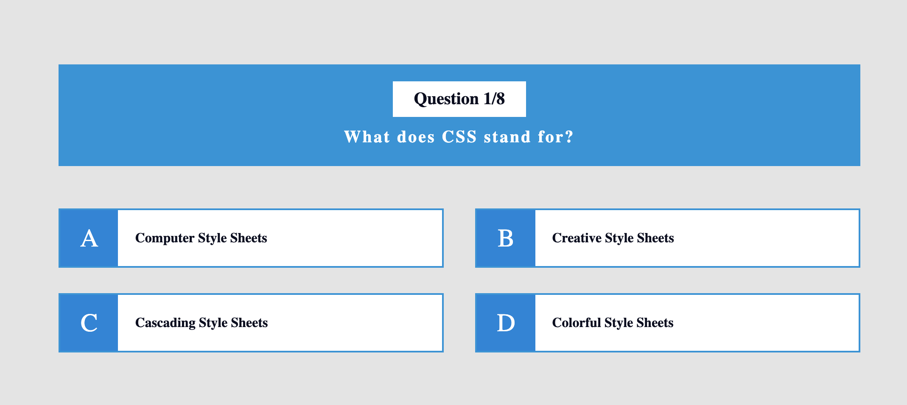

# &lt;/salt&gt;

## Salt Quiz with React & Redux

Your task is to create a quiz with multiple choice questions using React and Redux. 

Start by cloning this repositiory. 
We have already set up a template for you using `create-react-app`. 

It has React, Redux, Prop-Types and Redux Developer Tools included.

Just run 
`npm install` 
and 
`npm start` 
to begin coding your quiz application.

We have helped you write a root reducer in the `reducers` directory. 
Continue to complete `questionsReducer.js` and write your actions in the `actions` directory.

### UI Requirements
* Present each question on the screen one at a time with the answer options below the question.
* When the user clicks an answer option on screen, display to the user whether the answer is correct or incorrect. 
* Have at least 5 questions in the quiz.
* When the user has answered all questions, show them how many they answered correctly in total.

### Technical requirements
* Write your app in React.
* Keep state as an object in Redux.
* If you want - you can find your quiz questions and answers by using this [API](https://opentdb.com/api_config.php). 
Select a category, difficulty and choose "multiple choice" as type. You do not need to fetch the questions dynamically in the application.
* Use Redux actions to update state. I.e no setState() in any components.
* Write suitable tests for your component(s), actions and reducers.

### A few tips on the way
* Use the React and Redux developer tools! They are really useful.
* Check the console, make sure it's clean before sending in the code.
* Think about how to structure your app, which components you need to have and where you need to access your state (which component(s) need to be connected to Redux).
* Use consistent naming (e.g. don't mix camel case & hyphens).
* Use semantic html (e.g use the button element).
* Style your app so it is responsive.
* Think about the principles of Redux:
    * Single source of truth
    * State is read only (immutable)
    * Changes are made with pure functions as actions.

Have fun!!

Here is an example of what a Quiz question MIGHT look like (the design of your app is up to you!)

